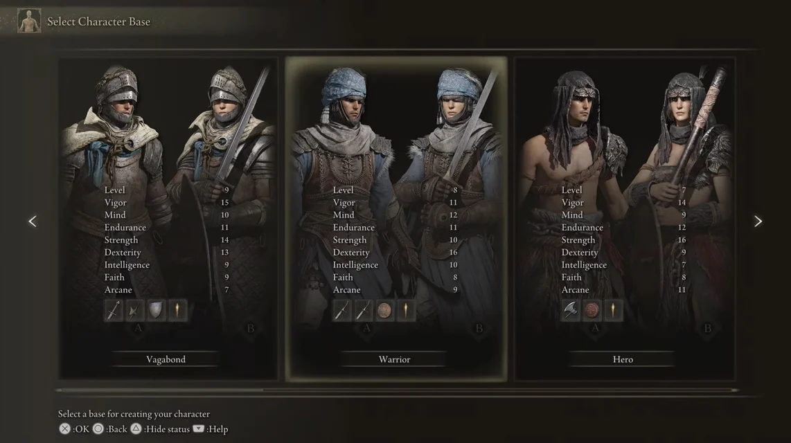

# Character Generator :game_die:
Project developed to generate a character based on the game [Elden Ring](https://pt.wikipedia.org/wiki/Elden_Ring).

The character could have an archetype, a race, a mount, a weapon and some habilities.

<h4 align="left"> 
	Author :pencil2:
</h4>

<p align="left">
 <a href="https://github.com/maycolteles">Maycol Teles Costa Dionisio Pereira</a> 
</p>

*********************

## Summary :clipboard:

* [Requirements](#requirements)
* [Setup and Installation](#setup-installation)
* [How to Use](#how-to-use)
* [Final Considerations](#final-considerations)

*********************
##  Requirements :pencil: <a name="requirements"></a>

* [Python 3.6+](https://www.python.org/)
* Pip 20.0+ (comes with Python 3)

*********************
##  Setup and Installation :white_check_mark: <a name="setup-installation"></a>

### Cloning the repo :file_folder:
First off, in order to get a copy of the project in order to run/test it, clone the repository into a folder on your machine:

```
git clone git@github.com:MaycolTeles/Character-Generator.git
```

### Creating and Activating the Virtual Environment :open_file_folder:
It is recommended to install the dependencies inside a [virtualenv](https://docs.python.org/3/tutorial/venv.html). So, inside the folder where you cloned the repository, create a new virtualenv:

```
python3 -m virtualenv venv
```
    
Then, activate the virtualenv (for Linux/MacOS):

```
source venv/bin/activate
```

or (for Windows):

```
venv\Scripts\activate
```

### Installing Dependencies :wrench:
To install all the necessary project dependencies, run the following command in the terminal:

```
pip install -r requirements.txt
```

### Creating the .env file :spiral_notepad:
In order to run the project, you must create a .env file to store the necessary environment variables (in this case, some database informations). So, go to the App folder ('/App') and open the file named "sample_env.txt". Follow the instructions inside it to create the .env file.

### Executing the Project :arrow_forward:
```
python App/main.py
```

*********************

## How To Use :man_technologist: <a name="how-to-use"></a>

Just follow the instructions on the terminal. When a number menu is shown, type the number that matches the option that you want. When just the options are shown, type the option that you want.

*********************

## Final Considerations :pushpin: <a name="final-considerations"></a>

The character creation could use a "Builder" or a "Factory" Design Pattern.

Also, the project's architecture and design could be improved.
